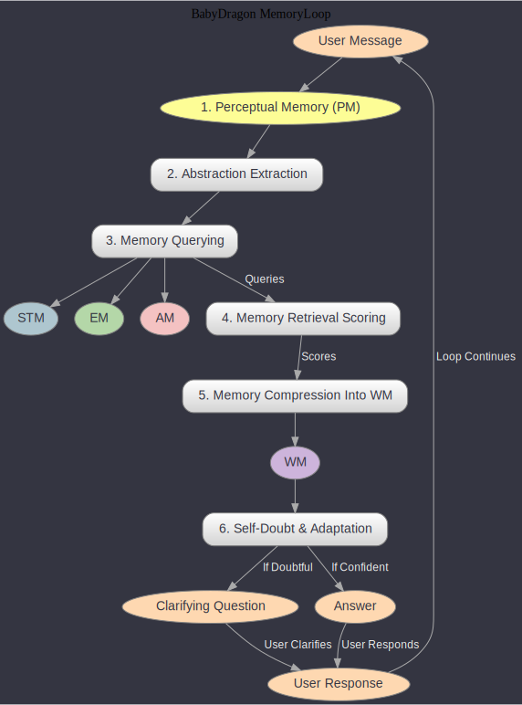

## Comprehensive Overview of BabyDragon MemoryLoop Framework

### Introduction
The BabyDragon MemoryLoop framework is designed to develop an advanced conversational AI agent. This agent manages user queries, sources information, formulates context-aware responses, and evolves through interaction-based learning. The framework is anchored by a tripartite memory system: Short-Term Memory (STM), Episodic Memory (EM), and Associative Memory (AM).

### Memory Components

#### Short-Term Memory (STM)
- **Function**: Temporarily stores recent user-AI interactions.
- **Role**: Acts as a dynamic log of ongoing dialogues, retaining both individual messages and the AI's current working memory state.

#### Episodic Memory (EM)
- **Function**: Archives conversation threads with metadata enhancements.
- **Role**: Utilizes NLP techniques to enrich historical records, aiding in recalling past interactions for contextualizing current queries.

#### Associative Memory (AM)
- **Function**: Stores and organizes knowledge as concepts and abstractions.
- **Role**: Instead of retraining models, AM categorizes new knowledge into structured formats, enhancing the AI's capability to enrich its Working Memory (WM) with relevant concepts and abstractions during interactions.

### Interaction Loop Process

The Interaction Loop Process in the BabyDragon MemoryLoop framework is a sequential procedure that enables the AI to process user inputs, access and utilize stored information, and generate responses. This process integrates the functionalities of Short-Term Memory (STM), Episodic Memory (EM), and Associative Memory (AM) to handle and respond to user queries efficiently. The following sections detail each step of this process, providing a clear understanding of how the AI operates within this framework.




#### 1. Perceptual Memory (PM)
- **Description**: Receives and processes the latest user message, analogous to human sensory memory.

#### 2. Abstraction Extraction
- **Description**: Analyzes incoming messages to identify key elements and deduces the user's intended goal.

#### 3. Memory Querying
- **Description**: Searches STM, EM, and AM for relevant information to the ongoing conversation.

#### 4. Memory Retrieval Scoring
- **Description**: Assesses the relevance of retrieved information against the interpreted user goal from PM.

#### 5. Memory Compression into WM
- **Description**: Condenses information into Working Memory (WM), updating it with relevant data and user goals.

#### 6. Self-Doubt & Adaptation
- **Description**: Employs a self-assessment mechanism to adapt its response strategy based on interaction progress.

### Pseudocode for Interaction Loop

```pseudocode
initialize STM, EM, AM

function handleUserQuery(userMessage):
    PM = processLatestMessage(userMessage)
    extractedAbstractions = extractAbstractions(PM)
    userGoal = deduceUserGoal(extractedAbstractions)

    relevantInfoSTM = querySTM(extractedAbstractions, userGoal)
    relevantInfoEM = queryEM(extractedAbstractions, userGoal)
    relevantInfoAM = queryAM(extractedAbstractions, userGoal)

    scoredInfo = scoreRetrievedInformation(relevantInfoSTM, relevantInfoEM, relevantInfoAM, userGoal)

    WM = compressIntoWorkingMemory(scoredInfo)

    if shouldAdapt(WM, userGoal):
        response = generateResponse(WM)
        updateSTM(response)
    else:
        seekClarification()

    if endOfSession():
        updateEMandAM(WM)

function processLatestMessage(message):
    // Process and return the latest user message as PM

function extractAbstractions(PM):
    // Extract and return abstractions from PM

function deduceUserGoal(abstractions):
    // Analyze abstractions to deduce and return user's intended goal

function querySTM(abstractions, goal):
    // Query and return relevant information from STM

function queryEM(abstractions, goal):
    // Query and return relevant information from EM

function queryAM(abstractions, goal):
    // Query and return relevant information from AM

function scoreRetrievedInformation(infoSTM, infoEM, infoAM, goal):
    // Score and return prioritized information

function compressIntoWorkingMemory(scoredInfo):
    // Compress information into WM and return updated WM state

function shouldAdapt(WM, goal):
    // Determine if adaptation is needed and return decision

function generateResponse(WM):
    // Generate and return response based on WM

function updateSTM(response):
    // Update STM with the new response

function seekClarification():
    // Seek further clarification from the user

function endOfSession():
    // Check if the session has ended and return decision

function updateEMandAM(WM):
    // Update EM and AM at the end of the session
```


